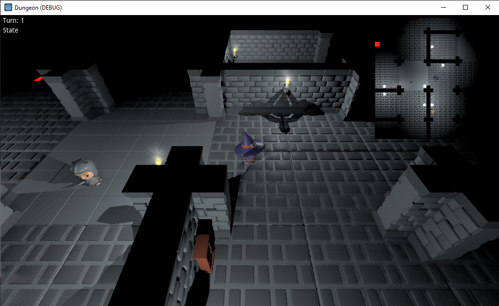

# Godot Dungeon crawler

This repository contains the source code for the dungeon crawler game I'm working on during my live streams including a single demo level using assets by [Kay Lousberg](https://kaylousberg.itch.io/).

Follow the progress of this project on [my Youtube channel](https://www.youtube.com/BastiaanOlij)

This project requires [Godot Engine](https://godotengine.org) v3.2.4 to run. This version of Godot has not been officially released at the time of writing this document. Please check the news section for download links of the latest Release Candidate.

## License

The code in this project written by me is released under MIT license.

The folder `assets` contains assets sourced from 3rd parties which fall under their own licenses. Check the folders for more information.

The folder `addons` contains 3rd party libraries which fall under their own licenses. Check the folders for more information.

## About this repository

This repository was created by and is maintained by Bastiaan Olij a.k.a. Mux213

You can follow me on twitter for regular updates here:
https://twitter.com/mux213

Videos about my work with Godot can by found on my youtube page:
https://www.youtube.com/BastiaanOlij

Support my work by becoming my Patreon:
https://www.patreon.com/mux213